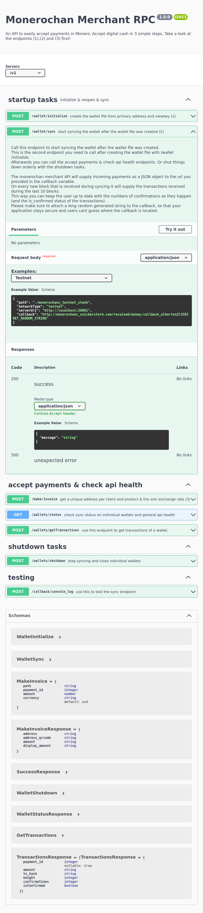

### Get started
clone this repository and run: `./monerochan-merchant-rpc` in this directory.
afterwards you can visit the interactive docs page at `http://localhost:3001/api-docs/`
The page you can access now in your browser at [http://localhost:3001/api-docs/](http://localhost:3001/api-docs/) looks like this:
